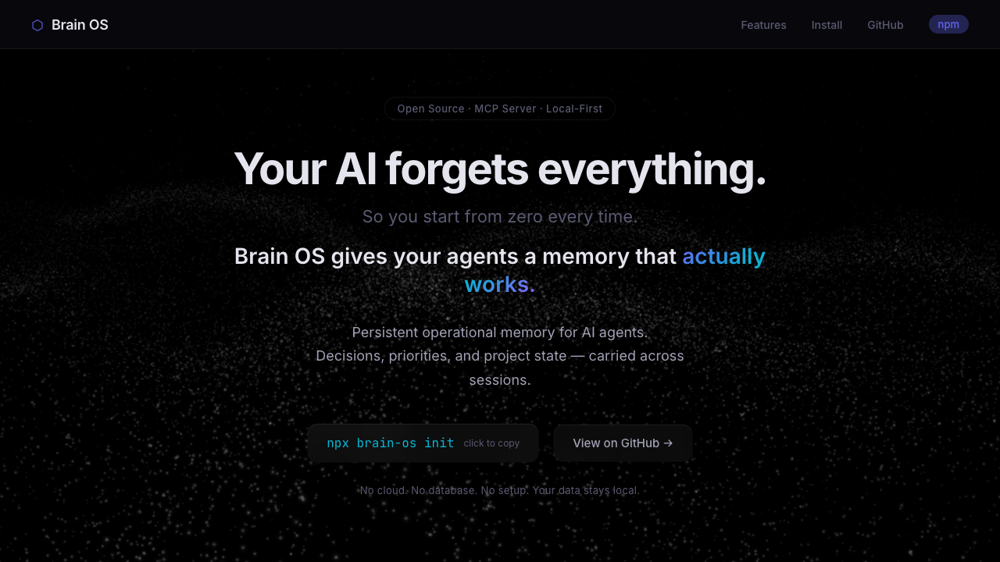

<p align="center">
  
</p>

<p align="center">
  <a href="https://www.npmjs.com/package/brain-os"></a>
  <a href="https://github.com/brainOS-HQ/brain-os/blob/main/LICENSE"></a>
  <a href="https://modelcontextprotocol.io"></a>
  <a href="https://brainos-hq.com"></a>
</p>

# Brain OS

**[brainos-hq.com](https://brainos-hq.com)**

Persistent operational memory for AI agents. Decisions, priorities, and project state that survive across sessions.

## What is this?

AI agents are powerful inside a session but start fresh every time. Brain OS gives them operational memory — not conversation logs, but structured state:

- **Entities** — track projects, deals, initiatives with status, momentum, blockers, and next moves
- **Decisions** — log what was decided, why, what alternatives were rejected, and when to revisit
- **Patterns** — detect recurring blockers, stale work, avoidance signals, and theme convergence
- **Focus** — prioritize what to work on based on urgency, momentum, leverage, and staleness
- **Semantic recall** — search memory by meaning, not just ID

Brain OS is an [MCP server](https://modelcontextprotocol.io) that works with any MCP-compatible client — Claude Code, Cursor, or any agent that speaks the protocol.

## What it looks like in use

Before the agent acts, it can check whether a proposed move conflicts with an existing decision:

```
> decision_check({ proposal: "switch to Postgres for the new service" })

{
  "verdict": "conflict",
  "conflicting_decision": {
    "id": "dec_2026_03_14_db_choice",
    "decision": "Use SQLite for all local-first projects",
    "reason": "Lower ops burden, no infra to run, fits single-user scope",
    "rejected_alternatives": ["Postgres", "DuckDB"],
    "logged_at": "2026-03-14"
  },
  "guidance": "Re-litigating a settled choice. Surface the prior reasoning to the user before proceeding."
}
```

That's the wedge: structured state with enforcement, so agents stop re-opening questions you already answered.

## Quick start

```bash
# In your project
npx brain-os init
```

This does two things:

1. **Creates a `.brain/` directory** with your entity, decision, and pattern stores.
2. **Installs slash commands** into `.claude/commands/` so you can run `/brain`, `/focus`, `/decide`, etc. directly in Claude Code.

Skip the slash commands with `npx brain-os init --no-commands` if you only want the MCP server.

### Connect to Claude Code

```bash
claude mcp add brain-os -- npx brain-os serve
```

### Connect to Cursor / other MCP clients

Add to your MCP config:

```json
{
  "brain-os": {
    "command": "npx",
    "args": ["-y", "brain-os", "serve"]
  }
}
```

## Tools

| Tool | Description |
|------|-------------|
| `entity_read` | Read operational state of one or all tracked entities |
| `entity_update` | Update entity state — status, momentum, blockers, next moves |
| `decision_log` | Log a strategic decision with reasoning and alternatives |
| `decision_check` | Check a proposed action against active decisions — returns clear/caution/conflict |
| `focus_get` | Get prioritized recommendations on what to work on |
| `pattern_detect` | Analyze patterns across all entities |
| `memory_check` | Audit memory quality — flags stale data, contradictions, noise |
| `memory_commit` | End-of-session commit — save all state changes |
| `semantic_recall` | Search memory by meaning using natural language |
| `audit_log` | Read the full mutation history — what changed, when, by whom |
| `plan_set` | Set an ordered plan for an entity — step 1 becomes active next_move |
| `plan_advance` | Complete or skip a step (requires evidence/reason) — auto-promotes next |
| `plan_add` | Add steps to an existing plan |
| `plan_read` | View plan progress and current step |

## Slash commands

`brain-os init` installs 8 slash commands into `.claude/commands/` so the agent has a clear vocabulary for working with operational state. Each command instructs the agent to call the right MCP tools and present results consistently.

| Command | What it does |
|---------|-------------|
| `/brain` | Project scanner: overview of all entities, freshness, decisions, alerts |
| `/focus` | "What should I work on today, and why?" with evidence |
| `/decide` | Capture a strategic decision (with conflict check before logging) |
| `/strategy` | Strategic thinking partner: think a decision through before building |
| `/wrap` | Session wrap: update entity state, capture decisions, detect momentum shifts |
| `/patterns` | Detect patterns across entities: recurring blockers, avoidance, themes |
| `/retro` | Weekly or monthly retrospective: what shipped, what stalled, what's hidden |
| `/graph` | Show how entities connect, leverage opportunities, shared decisions |

### Automatic namespace fallback

If a command with the same name already exists in `.claude/commands/` (from another tool), Brain OS detects the collision and installs **all** its commands under the `/brain:` namespace instead — uniformly. So you'd get `/brain:focus`, `/brain:wrap`, etc. Your existing files are never overwritten.

Re-running `init` is safe: existing Brain OS commands are preserved.

## How it works

Brain OS stores everything as local JSON files in a `.brain/` directory:

```
.brain/
  entities/     — one file per tracked entity
  decisions/    — decision log
  patterns/     — detected patterns
  config.json   — workspace settings
```

No cloud. No database. No account. Your data stays on your machine.

## Auto-loaded status

When an MCP client connects, Brain OS exposes a `brain://status` resource with an operational overview — active entities, alerts, top priority, and recent decisions. The agent starts every session with context, not amnesia.

## License

MIT
